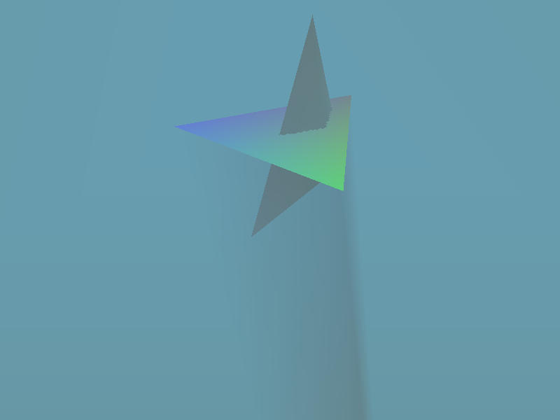
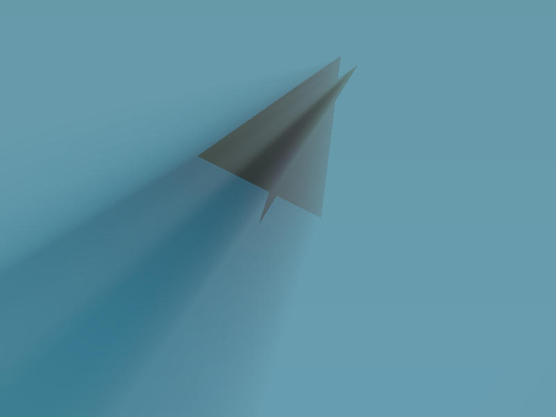
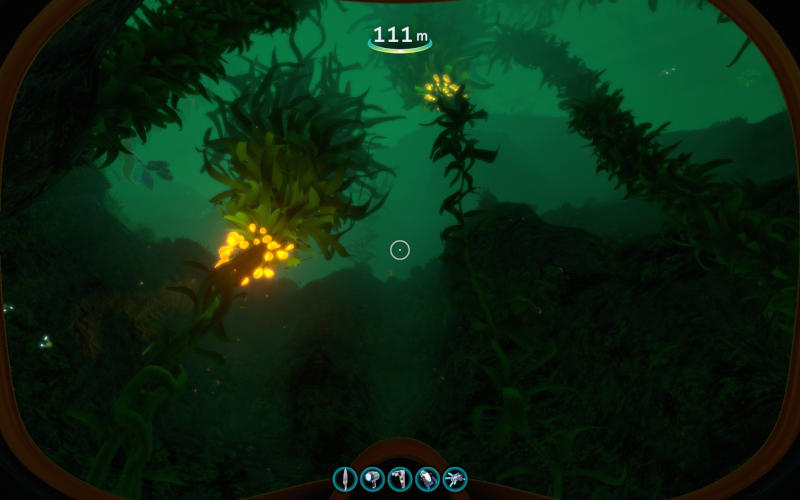
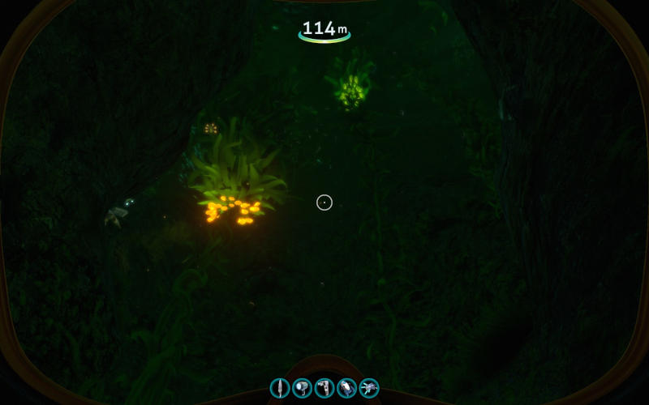

# Neritigen

This is a prototype I did to learn more about Vulkan and to bang out an idea I
had for a GPU-friendly algorithm to draw volumetric lighting (objects casting
shadows through smoke, haze or water, A.K.A. god rays). The volumetric lighting
is on the
[lighting-prototype](https://github.com/swooster/neritigen/tree/lighting-prototype)
branch.

To be clear, this is a just prototype, not how I'd try to write long-term code
(see the [ashpan](https://github.com/swooster/ashpan) crate I wrote for an
example of something more professional). As such it has a number of problems
such as snapshot commits towards the end, and lack of documentation. However,
it did show that the core algorithm works!

What inspired me to do this? I love Subnautica, but I'm driven bonkers by an
inaccuracy in how it handles ambient lighting. The following two screenshots
were taken during the day at nearly the same location, yet the second
screenshot looks like nighttime:

The reason for this is that Subnautica's ambient lighting conditions are
globally determined by the viewer's location. If the viewer is in a cave, the
ambient lighting is dark, and if they're outside, it's light. In the second
screenshot above, the viewer is in the mouth of a cave so the open ocean is
incorrectly being drawn as though sunlight isn't reaching it.

I wanted to come up with an algorithm that would draw this particular situation
correctly, not rely on the viewer's position to adjust global lighting. When
you think about it, the difference between the color of the open ocean vs
inside a cave is the same as the difference between the part of the atmosphere
lit by a god-ray vs shadowed by clouds. Unfortunately, typical god-ray tech is
more of an illusion added in post-processing, so it won't look correct if the
viewer is looking downwards. I wanted to build a proper solution for volumetric
lighting, equivalent to raytracing through a shadow buffer.

My idea is based on Doom 3's stencil shadows and on how you calculate the area
of a 2D polygon (you can think of light scattered towards the camera as a
weighted volume). Because light is additive and addition is commutative, you
don't actually need to raytrace through a light volume. For part of the
surface of the light volume, you calculate the amount of light that would be
scattered towards the camera if the light volume extended from that surface out
to infinity, then add the light if the surface is facing towards the camera and
subtract it if the surface is facing away from the camera, and it'll sum to the
amount of light coming from within the volume. You still need to handle capping
the light volume at the near clipping plane and at any geometry, but that's
doable with Doom 3 stencil shadows, and you can even adjust it to calculate
both caps simultaneously by using a stencil mask of 0b101 (then inverting the
stencil flips both bits and incrementing it only flips one).
